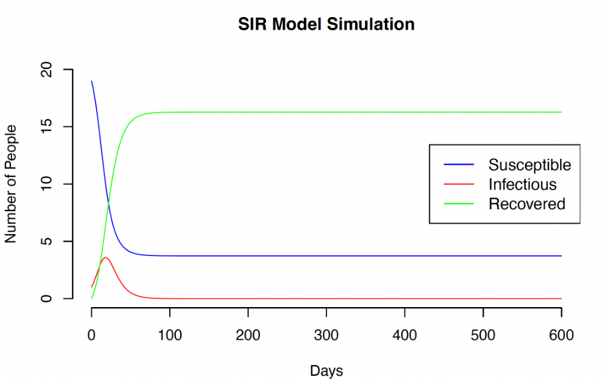

# 📈 Simulating Disease Dynamics Using The SIR Model
This project uses the Susceptible-Infected-Recovered (SIR) model to simulate and analyze the spread of infectious diseases, exploring the impact of infection and recovery rates on disease dynamics over time.
  

# Context
This project utilizes a deterministic Susceptible-Infected-Recovered (SIR) model to simulate the spread of an infectious disease within a population. The SIR model divides the population into three compartments: susceptible individuals *S*, infected individuals *I*, and recovered individuals *R*. Accordingly, *S(t) + I(t) + R(t) = N*, where *t* is time and *N* is population size. The simulation runs over a specified period (600 days), where the transitions between these states are governed by the infection rate *a* and recovery rate *b*. The initial population consists of 20 individuals, with one infected person and no recovered individuals. The model calculates the number of susceptible, infected, and recovered individuals at each time step using simple differential equations. The goal of the simulation is to understand how the disease spreads over time and the impacts of different parameters on the disease dynamics.

Word Count: 136 words
  

# Results and Analysis
The code simulates the spread of an infectious disease wih customizable parameters like recovery rate *b*, infection rate *a*, and population size *N*. The simulation produced typical behavior for an SIR model, with the number of susceptible individuals decreasing as they became infected, while the infected population rose and later fell as individuals recovered. The peak of the infected population occurred early in the simulation, followed by a gradual decline as more individuals transitioned to the recovered state. Throughout the simulation, the total population remained constant, as no births or deaths were modeled. The infection rate and recovery rate were crucial in shaping the dynamics of disease spread. Higher infection rates led to a faster rise in the number of infected individuals, while a higher recovery rate resulted in a quicker decline in the infected population. The results emphasized the impact of these parameters on the timing and magnitude of the disease's peak.

Future improvements to this simulation could include incorporating more realistic dynamics, such as birth and death rates to account for population turnover. Additionally, including factors like vaccination, immunity loss, or external interventions (e.g., quarantines) would make the model more applicable to real-world scenario. 

Word Count: 196 words
  

# Output

# Languages Used
- **R**
